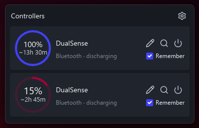
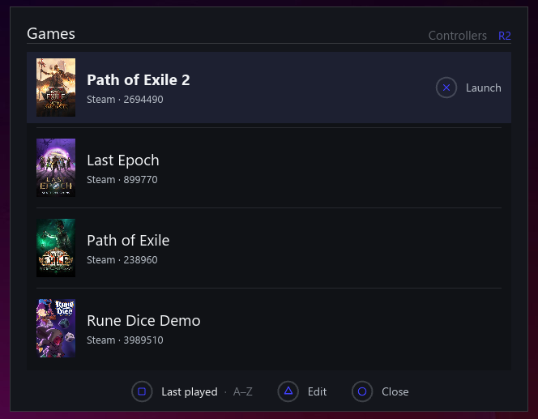
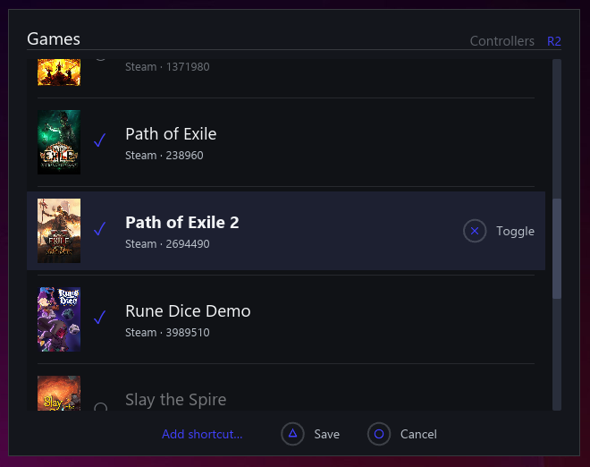
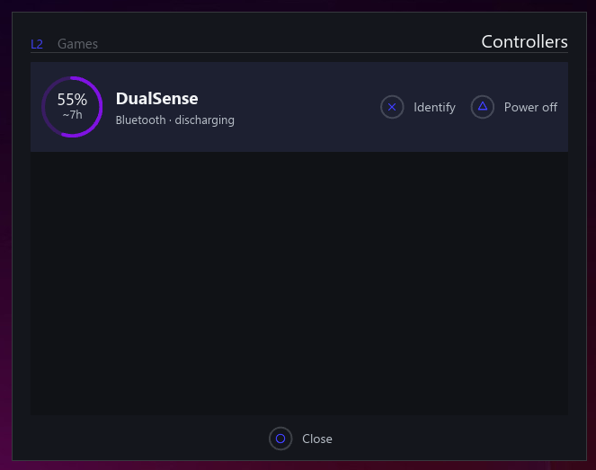
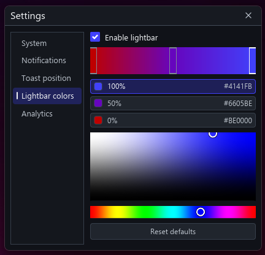
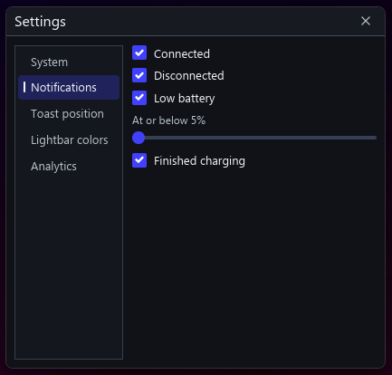
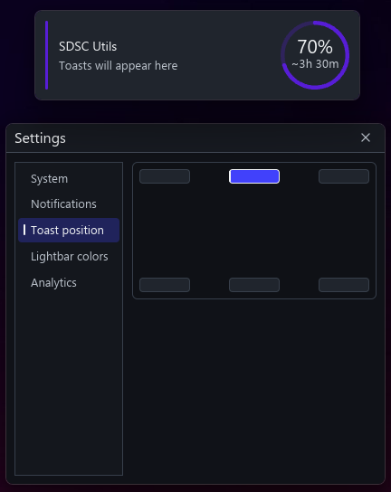
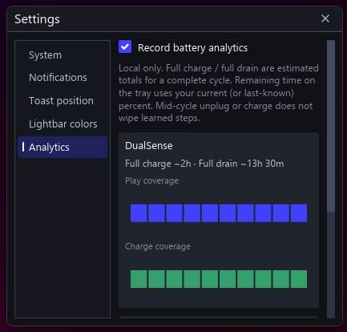

# SDSC Utils

System tray app for DualSense wireless controllers (and DualSense Edge): battery levels, lightbar colors from charge, identify flash, overlay toasts, an optional DualSense **start screen** game launcher, and local battery analytics.

**Unofficial.** DualSense, DualSense Edge, PlayStation, and related marks are trademarks of Sony Interactive Entertainment Inc. This project is not affiliated with, endorsed by, or sponsored by Sony.

## Screenshots

<p align="center">
  
</p>

<p align="center">Controller popup — battery %, remaining-time estimate, Identify / Turn off, and Remember</p>

<p align="center">
  
</p>

<p align="center">Start screen — Games list with DualSense Launch, sort, Edit, and Close hints</p>

<p align="center">
  
  &nbsp;
  
</p>

<p align="center">Edit catalog (Steam checklist) and Controllers tab (Identify / Power off)</p>

<p align="center">
  
</p>

<p align="center">Settings → Lightbar — enable toggle, multi-stop spectrum, and color picker</p>

<p align="center">
  
  &nbsp;
  
</p>

<p align="center">Notifications and toast corner placement</p>

<p align="center">
  
</p>

<p align="center">Settings → Analytics — opt-in local charge/drain learning and coverage charts</p>

## Download

**Recommended (Windows):** install from the [Microsoft Store](https://apps.microsoft.com/) once the listing is live (search for **SDSC Utils**). Store installs are signed by Microsoft and update automatically through the Store / `winget`.

**Advanced:** portable builds are attached to [GitHub Releases](https://github.com/LankyMoose/sdsc-utils/releases) as `sdsc-utils.exe`. That executable is **not** Authenticode-signed. Browsers and Windows SmartScreen often warn on uncommon unsigned downloads — that is expected. There is no in-app auto-update for the portable build; download the next release manually when you want it.

## Features

- Tray icon with a DualSense silhouette
- Tooltip shows how many controllers are connected
- Left-click the tray icon for a dark controller popup with battery state, optional **nicknames** (pencil icon beside each name), **Identify** / Bluetooth **Turn off** icon actions, and an opt-in **Remember** checkbox; right-click for **Settings** and **Exit**
- **Remember** a controller to keep it in the popup after disconnect with its last-known charge % (off by default)
- Assign a **nickname** to any pad with a known serial; nicknames survive forgetting a pad and are used in the popup and overlay toasts
- Bluetooth **Turn off** sends the DualSense soft power-off command (same idea as holding the PS button)
- Steam-style overlay toasts when a pad **connects**, **disconnects**, hits **low battery** (at or below a configurable % while discharging; default ≤5%), or **finishes charging** (tray → **Settings**; on by default)
- Toasts appear in any configurable screen corner as always-on-top cards and dismiss on click or automatically after five seconds
- Dark **iced** Configure window for notification (including low-battery %), toast-position, autostart, lightbar, start-screen (System tab), and **opt-in battery analytics** settings
- **Battery analytics** (off by default): learns each DualSense battery step for charge and play, shows remaining-time estimates after one qualifying step (interpolating within the current percent bucket; refining as more steps are observed; mid-cycle unplug/charge does not wipe history), and draws per-controller coverage charts in Settings → Analytics (local `analytics.json` only; open the data folder from Settings → System to inspect or delete files)
- Detects controllers connecting/disconnecting within a few seconds
- **Start screen** (Settings → Start screen): headline quick-launch when the first DualSense connects — curated Steam games and manual shortcuts, Games ↔ Controllers tabs (L2/R2), DualSense and keyboard nav. Cross/Enter launches; Circle/Escape closes; Square edits the catalog (Steam checklist + Add shortcut); Options toggles Last played ↔ A–Z; Controllers tab supports Identify and Bluetooth power-off. Opens with an empty catalog. Optional UI sounds with volume. Any connected pad can drive the UI (inputs are not merged across pads). Reopen with a configurable chord (default PS / Guide). Catalog lives in `games.json` under the data folder
- Lightbar color blends across a customizable **2–5 stop spectrum** (default **blue → purple → red**) as battery drops (reasserted about every 5 seconds); edit via tray **Settings** with a left-hand tab list. An **Enable lightbar** toggle (on by default) pauses battery-driven colors and the low-battery pulse while leaving Identify available. The Lightbar panel stays fully expanded when active: drag stops along the bar, click empty areas to add stops (up to 5), and drag a stop away to remove it (down to 2). Changes apply immediately.
- At **low battery while discharging** (same configurable threshold as the toast; default ≤5%), the lightbar periodically pulses **orange**
- Icons live in `assets/icons/` (SVG) and are rasterized at build/runtime
- UI shell is an **iced** daemon (tray via `tray-icon`); Configure, controller popup, and toasts are iced windows
- Single-instance (second launch exits quietly)
- Logs to a file (see Troubleshooting)

## Compatible hardware

- DualSense wireless controller
- DualSense Edge wireless controller

## Build

Requires Rust **1.88+** (edition 2024).

```bash
cargo build --release
```

Binary: `target/release/sdsc-utils` (`.exe` on Windows).

Release builds do **not** include the developer emulator (`dev-emulate` is off by default).

Package identity: `package.name` in `Cargo.toml` is `sdsc-utils`; display name is `DISPLAY_NAME` in `src/app_meta.rs` (runtime paths follow the package name).

### Local git hooks (all branches)

After cloning, point Git at the repo hooks once (stored in `.git/config`, not committed):

```bash
git config core.hooksPath .githooks
```

- **pre-commit** — runs `cargo fmt --all` and re-stages already-staged `.rs` files.
- **pre-push** — runs the same checklist as CI (`scripts/ci.sh`: fmt check, clippy `-D warnings`, tests) on **every** branch you push.

Bypass with `git commit --no-verify` or `git push --no-verify` when needed. You can also run checks manually: `bash scripts/ci.sh`.

## Run

```bash
cargo run --release
# or
./target/release/sdsc-utils
```

### Developer emulator (optional)

For testing notifications without real hardware, build with the `dev-emulate` feature and pass `--dev`:

```bash
cargo run --features dev-emulate -- --dev
```

That unlocks a **Developer** section in the **Configure** window with emulated controller presets (low battery, charging, fully charged, etc.) and **battery analytics** presets (seed estimates, plug/charge/drain/pause/resume steps with time fast-forward). Emulation is not compiled into normal release binaries.

### CLI

| Flag | Description |
|------|-------------|
| `-h` / `--help` | Print usage and exit |
| `-V` / `--version` | Print version and exit |
| `--install-autostart` | Windows: enable login autostart for this build |
| `--uninstall-autostart` | Windows: disable that autostart entry |
| `--list-controllers` | Print connected DualSense pads and exit |
| `--dev` | Enable Developer controls in Configure (only when built with `--features dev-emulate`) |

## Windows notes

- Release builds use the Windows subsystem (no console window for the tray app).
- The `.exe` and tray share the same DualSense SVG icon (rasterized at build time via `winres`).
- Log file: `%APPDATA%\sdsc-utils\app.log` (grep `hid-worker:` for DualSense HID timing: `enumerate_ms` / `open_ms` / `io_ms` / `total_ms` per poll, Identify, lightbar). Start-screen pad input is sampled on the hid-worker thread and read as a snapshot on PadPoll (UI never opens DualSense HID).
- Prefs file: `%APPDATA%\sdsc-utils\prefs.json` (notification toggles/threshold/position + lightbar spectrum/enabled + analytics opt-in)
- Remembered controllers: `%APPDATA%\sdsc-utils\controllers.json` (remembered pads + nicknames)
- Battery analytics (when enabled): `%APPDATA%\sdsc-utils\analytics.json` (per-pad step samples + in-progress timer)
- Autostart: portable builds write `sdsc-utils.lnk` into the user Startup folder; Microsoft Store / MSIX builds use a packaged Startup Task (both toggleable in **Configure**). Older portable `.cmd` entries are migrated to `.lnk` automatically.
- Overlay toasts work over desktop, windowed, and borderless-fullscreen content. Exclusive fullscreen and some protected games can remain above all desktop windows.
- The left-click controller popup is available on Windows and macOS. The `tray-icon` Linux backend does not emit tray click events; use the right-click **Settings** menu there.
- MSIX packaging for Store submission: see [`packaging/README.md`](packaging/README.md).

## Platform support

| Platform | Status |
|----------|--------|
| Windows | Primary / tested |
| macOS | Expected to work (`hidapi` + `tray-icon`) |
| Linux | Expected to work; needs GTK for the tray (`tray-icon` gtk feature) and system `hidapi`/udev rules for DualSense access |

### Linux dependencies (typical)

- GTK 3 development libraries (for tray)
- `libhidapi` / pkg-config as required by the `hidapi` crate
- Permission to open the DualSense HID device (udev rule or group membership)

### macOS

- Grant Input Monitoring / accessibility only if macOS prompts for HID access
- Autostart is not automated; use Login Items manually if desired

## Battery accuracy

DualSense firmware reports battery in **11 coarse steps** (0–10). Percentages use the Linux mid-point mapping (e.g. step 0 → 5%, step 9 → 95%, step 10/full → 100%).

## Troubleshooting

- **Log file**
  - Windows: `%APPDATA%\sdsc-utils\app.log`
  - Unix: `$XDG_STATE_HOME/sdsc-utils/app.log` or `~/.local/state/sdsc-utils/app.log`
- **Second launch does nothing** — only one instance is allowed; the second process exits after logging.
- **Exe icon looks stale in Explorer** — rebuild release, then refresh the folder or restart Explorer (Windows caches icons).
- **Controller not listed** — wait a few seconds after power-on (presence is scanned every 3s); check the log if open/read fails.
- **Tray slow to show disconnect** — fixed in 0.1.2 (faster liveness probes). Bluetooth pads can linger in Windows HID briefly after power-off.
- **Same controller listed twice (USB + Bluetooth)** — fixed in 0.1.3 (MAC-based identity; USB preferred).
- **Lightbar stuck off or default blue** — fixed in 0.1.6 (separate `LIGHT_OUT` claim, then RGB). The app reasserts battery color about every 5s so other software (game launchers, etc.) does not keep the bar after a one-shot overwrite. Test with `--set-lightbar 255 100 0`. If it still fails, check the log for HID write errors.

## Releases

See [CHANGELOG.md](CHANGELOG.md) for release notes.

CI builds on Windows. To publish a binary + MSIX artifact:

```bash
git tag v1.4.1
git push origin v1.4.1
```

The release workflow attaches `sdsc-utils.exe` and `sdsc-utils.msix` to the GitHub Release for that tag. Upload the MSIX to Partner Center for Store distribution. You can also run the **Release** workflow manually (`workflow_dispatch`).

## Privacy policy

This program will not transfer any information to other networked systems unless specifically requested by the user or the person installing or operating it.

Battery status, notification preferences, lightbar colors, remembered controllers, and (when enabled) battery analytics stay on the local machine (`prefs.json`, `controllers.json`, `analytics.json`, and `app.log` under the app data directory). Toasts are rendered locally by the app. There is no telemetry, account, or network API.

## License

MIT — see [LICENSE](LICENSE).
